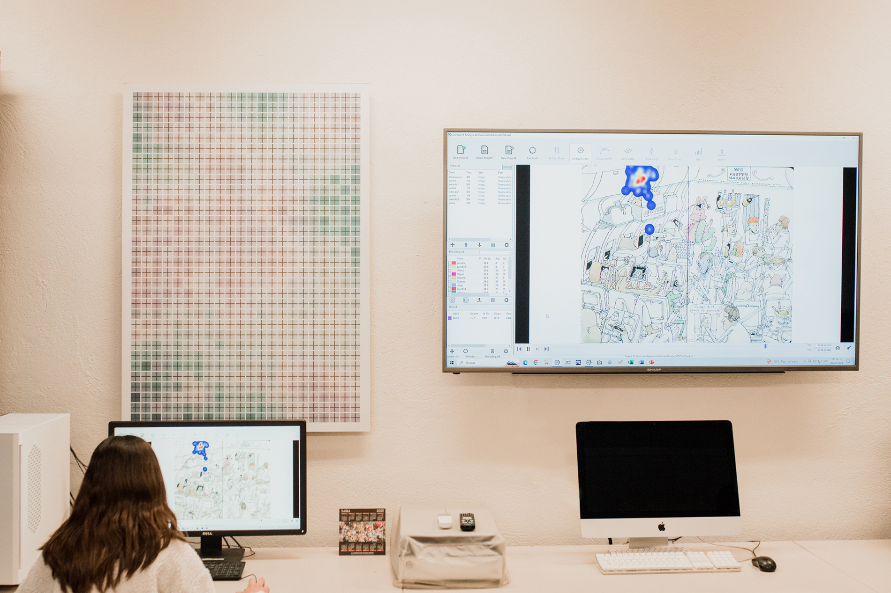

*Laboratorio de Experimentación Multimedia. UASLP (2024)*

# Estudios de Percepción Visual

El presente proyecto tiene como objetivo el estudio de la percepción de la forma a partir del comportamiento del ojo frente a un estímulo organizado. La principal finalidad de este trabajo de laboratorio consiste en monitorear el proceso de visualización (número de fijaciones, rutas de exploración, duración de la mirada fija en un área de interés y la densidad espacial de las fijaciones). Parte de un análisis de la imagen mediante un software especializado en análisis de Saliencia para determinar las zonas que sobresalen en la composición, y se complementa con los resultados obtenidos mediante un desarrollo experimental basado en una prueba de rotación y seguimiento ocular con un dispositivo llamado Eye Tracking, obteniendo un patrón de exploración y el trabajo perceptual realizado, lo que finalmente se compara con un test aplicado a los usuarios en el que se indaga sobre su experiencia en el proceso perceptual. Se someten a experimentación obras de arte, carteles, revistas, periódicos, libros, entre otros medios de origen visual.

## Método

La principal finalidad de este trabajo de laboratorio consiste en monitorear el proceso de visualización a través de diferentes parámetros:

- Número de fijaciones
- Rutas de exploración
- Duración de la mirada fija en áreas de interés
- Densidad espacial de las fijaciones

## Etapas
El estudio se desarrolla en varias etapas:

1. Análisis de la imagen mediante software especializado en análisis de Saliencia para determinar las zonas que sobresalen en la composición
2. Desarrollo experimental basado en pruebas de rotación y seguimiento ocular con dispositivo Eye Tracking
3. Análisis de datos
4. Obtención de patrones de exploración y trabajo perceptual
5. Aplicación de tests a usuarios

## Lugar
El Laboratorio de Experimentación Multimedia (LEM) de la Universidad Autónoma de San Luis Potosí, se conforma como un puente entre la ciencia y los productos de diseño, ahondando en el estudio de los procesos y la creación de las formas, así como en la exploración de nuevos conceptos derivados del avance tecnológico del Siglo XXI. En el LEM participa un equipo multidisciplinar de las áreas de la ciencia y el diseño, centrados en el estudio, la invención y el uso creativo de las tecnologías digitales para el mejoramiento de las formas en que se conciben, se materializan y comunican ideas de diseño.

## Productos académicos

``Guerrero Salinas, M. ., & Mancilla González, E. . (2024). Análisis de la percepción visual en la página editorial posmoderna. Zincografía, 8(16). https://doi.org/10.32870/zcr.v8i16.235``

``Guerrero Salinas, M. (2023). The Eye tracking, una herramienta complementaria para la evaluación del diseño. Zincografía, 7(13). https://doi.org/10.32870/zcr.v7i13.203``

``Mancilla, E. (2021). El análisis de saliencia en la percepción visual del color. En Irigoyen, L. Villalba, E. (Ed.) Prospectiva del diseño. Redefiniendo el futuro disciplinar, Volumen 1. (pp. 200-217). Hermosillo, México: Universidad de Sonora.``

``Carrillo-Chávez, I. Mancilla, E. Guerrero-Salinas, M. (2021). Definición de la usabilidad a través de la tecnología del eye tracking. Experiencias en proyectos de investigación de la Especialidad en Ciencias del Hábitat. En Irigoyen, L. Villalba, E. (Ed.) Prospectiva del diseño. Redefiniendo el futuro disciplinar, Volumen 1. (pp. 234-245). Hermosillo, México: Universidad de Sonora.``

``Mancilla, E. (2021). Percepción de la forma: Pruebas de seguimiento ocular. En Guerrero-Salinas, M (Ed.), Reflexiones sobre Diseño en la Actualidad (pp. 324 -342). San Luis Potosí, México: Universidad Autónoma de San Luis Potosí. http://bit.ly/cavd_l02``

``Mancilla, E. Guerrero, M. (2020). Análisis del proceso de percepción visual en la obra de arte. en Rumbos atrevidos, pero necesarios. Conversación entre innovación, arte y creatividad. GKA Ediciones``

``Oliva, I. (2020). Rediseño editorial y estandarización de la revista H+D Hábitat mas Diseño en su versión Impresa. [Tesis de Especialidad inédita]. Universidad Autónoma de San Luis Potosí.``

``Ramírez, A. (2020). Tu visita al museo Leonora Carrington San Luis Potosí. [Tesis de Especialidad inédita]. Universidad Autónoma de San Luis Potosí. `` 

``Mancilla González, E., Guerrero-Salinas, M., y Cuevas Riaño, M. D. M. (2019). El papel de la tecnología en los estudios de percepción visual en diseño gráfico. Revista Internacional de Principios y Prácticas Del Diseño 1(2), 11–27. https://doi.org/10.18848/2641-4406/CGP/v01i02/11-27``

``Soriano, F. Mancilla, E. (2016). Estudio de la percepción visual de la forma: Ilusiones ópticas. Verano de la ciencia. Universidad Autónoma de San Luis Potosí.``

``Patricio, N. Mancilla, E. (2106). Análisis de la forma básica y la percepción visual en la obra de Vasili Kandinsky. Verano de la ciencia. Universidad Autónoma de San Luis Potosí``

